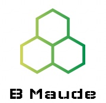

# BMaude
BMaude is a verification tool for B specifications written in the Abstract Machine Notation. The tool is implemented in the [Maude](http://maude.cs.uiuc.edu) language, by Christiano Braga (<http://www.ic.uff.br/~cbraga>).

## System requirements
* This version of BMaude requires Maude Alpha 115. (Even though this version is not directly available from Maude's web site, it can be obtained free of charge by joining the Maude (Ab)users group by sending an email to maude-users@cs.uiuc.edu.)
* [iTerm 2](https://www.iterm2.com) on [macOS](https://www.apple.com/br/macos/) produces a nicer experience.

## Installing the tool

Simply copy the files to your prefered folder and edit bmaude shell script to update the shell variables accordingly.

## Running the tool

Type `./bmaude file.bmaude` on the command line. 

For a demo, just run `./bmaude demo`.

### Acknowledgements

Narciso Martí-Oliet, Maurício Pires, Anamaria Moreira and David Deharbe gave invaluable contributions to this project.

Logo made with <a href="https://www.designevo.com/" title="Free Online Logo Maker">DesignEvo</a>.

